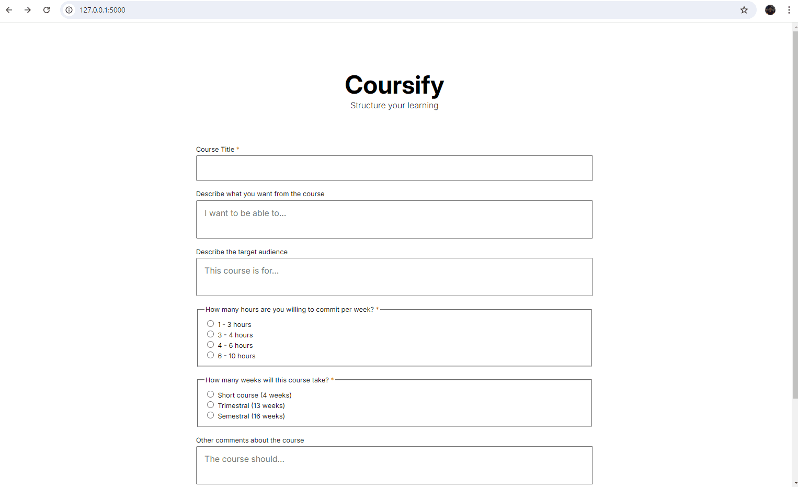
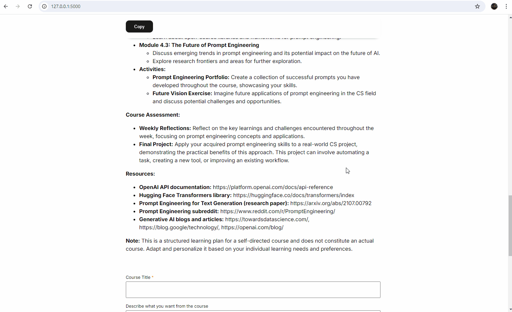

# Coursify - Create a structured learning experience personalized for you!

Coursify is a web application that can generate **custom course syllabi** or 
learning plans tailored to your specific needs. 

Whether you want to hone a new skill or dive deep into a concept you're 
passionate about, Coursify provides **a structured learning** path that fits 
you perfectly, **eliminating the aimless drifting** often associated with 
self-directed learning.

## Table of Contents
- [Features](#features)
- [Demo](#demo)
- [Installation](#installation) <!-- - [Usage](#usage) -->
- [Technologies](#technologies) <!-- - [API Integration](#api-integration) -->
- [Project Structure](#project-structure)
- [Contact Information](#contact-information)
- [Further Enhancements](#further-enhancements)

## Features
- Generates a course syllabus based on a title, the objectives and the target 
audience.
- Flexible options for course duration and weekly hour commitment to match your 
schedule.
- Easy-to-use web interface.
- Copies generated syllabi to clipboard.

## Demo
### Customize your learning plan

Tell Coursify your needs: from the course title to the main goals, this 
intuitive form helps you create a personalized learning plan.

### Generate the syllabus

Simply click the button to generate your syllabus. Within moments, you’ll 
receive a tailored learning plan designed just for you.

### Copy anywhere for convenience

Easily copy your learning plan to your clipboard and paste it into any document 
or note-taking app. Convenient and hassle-free!

<!-- ## Running Locally

### Installation

### Usage -->

## Technologies
- Python 3.10+
- Flask
- Google Generative AI API (Gemini 1.5)
- Markdown
- HTML/CSS (with Google Fonts)

<!-- ## API Integration
This project uses [Google Generative AI](https://cloud.google.com/generative-ai)
to generate course syllabi based on user input. To access their API, you need 
to:
1.  -->

## Project Structure

```
├── app.py # Flask application entry point
├── model.py # AI model integration with Google API
├── templates/
│ └── form.html # HTML template for the form
├── static/
│ └── style.css # CSS styles
├── requirements.txt # Python dependencies
└── README.md # Project documentation
```

## Contact Information
Created by [Daniel III Ramos](https://github.com/dhannn). Feel free to 
contact me at [daniel_ramos@dlsu.edu.ph](mailto:daniel_ramos@dlsu.edu.ph)

## Further Enhancements
- Enhance form validation and error handling
- Implement a download feature for syllabi as PDF
- ~~Deployment to an external server~~
- ~~Better UI for the copy button~~
- Mobile-friendly UI
- Simple user management and authentication for saving learning plans