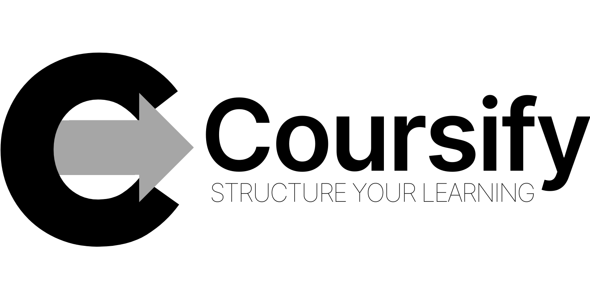

# Coursify - Create a structured learning experience personalized for you!
Coursify is a web application that can generate **custom course syllabi** or 
learning plans tailored to your specific needs. 

Whether you want to hone a new skill or dive deep into a concept you're 
passionate about, Coursify provides **a structured learning** path that fits 
you perfectly, **eliminating the aimless drifting** often associated with 
self-directed learning.

## Table of Contents
- [Features](#features)
- [Demo](#demo)
- [Installation](#installation) 
- [API Integration](#api-integration)
- [Usage](#usage)
- [Technologies](#technologies) 
- [Project Structure](#project-structure)
- [Contact Information](#contact-information)
- [Further Enhancements](#further-enhancements)

## Features
- Generates a course syllabus based on a title, the objectives and the target 
audience.
- Flexible options for course duration and weekly hour commitment to match your 
schedule.
- Easy-to-use web interface.
- Copies generated syllabi to clipboard.
- Download your learning plans as PDFs.

## Demo
### Customize your learning plan

Tell Coursify your needs: from the course title to the main goals, this 
intuitive form helps you create a personalized learning plan.

### Generate the syllabus

Simply click the button to generate your syllabus. Within moments, you’ll 
receive a tailored learning plan designed just for you.

### Copy anywhere for convenience

Easily copy your learning plan to your clipboard and paste it into any document 
or note-taking app. Convenient and hassle-free!

## Running Locally

You can run Coursify in your own machine by following these instructions.

### API Integration

This project uses [Google Gemini API](https://ai.google.dev/gemini-api) to 
generate learning plans based on user input. To access their API, you need to:

1. Go to [Google Gemini API](https://ai.google.dev/gemini-api) to get API key.
2. Click `Create API key` and select a project.
3. Copy the key and store it securely as an environment variable `GENAI_API_KEY`.

### Installation

1. Clone [the GitHub repository](https://github.com/dhannn/coursify).
2. Change directory to `coursify`:
    ```bash
    cd coursify
    ```
3. Install the dependencies:
    ```bash
    pip install -r requirements.txt 
    ```
4. Run the Flask app:
    ```bash
    flask --app main.py run
    ```

    To enable debug mode and hot reloading, add the debug flag:
    ```bash
    flask --app main.py --debug run
    ```

### Usage
1. Access the application by opening your browser and going to `http://127.0.0.1:5000/`.
2. Customize your learning plan by accomplishing the form:
    - **Course title** *(required)*: The topic you want to explore. <br> Example: 
        - Prompt Engineering for CS Students
        - Marketing Analytics Using Big Data
        - Introduction to Human-Centered Design
        - Project Management in Creative Industries
    - **What you want from the course**: Main skills or concepts you want to attain 
    after the learning plan. <br> Example: 
        - leverage LLMs to improve efficiency in common CS tasks such as software 
        development, data analysis, and algorithm optimization 
        among others.
        - utilize big data techniques to enhance marketing strategies, customer segmentation, and campaign performance among others.
        - apply design thinking principles to create user-centered products, improve usability, and innovate solutions among others.
        - develop project management skills to oversee creative projects, improve team collaboration, and meet client expectations among others.

    - **Target audience**: <br> Example: 
        - CS students who have a basic knowledge on machine learning models
        - Marketing professionals interested in data-driven decision-making
        - Designers and product managers focused on user experience
        - Creative industry professionals aiming to improve project outcomes
    - **Hours of commitment per week** *(required)*
    - **Duration of course** *(required)*
    - **Other comments**: special requirements or constraints <br>
        Example:
        - have a final project that applies theoretical knowledge to practice
        - access to industry-standard marketing tools for practical exercises
        - opportunity to collaborate on a design project with a real client
        - requirement to complete a capstone project that showcases management skills
3. Click `Coursify` to generate a learning plan. It may take at most a minute 
to generate.
4. You can copy the Markdown of the learning plan or download as PDF.

## Technologies
- Python 3.10+
- Flask
- Google Generative AI API (Gemini 1.5)
- Markdown
- HTML/CSS (with Google Fonts)

<!-- ## API Integration
This project uses [Google Generative AI](https://cloud.google.com/generative-ai)
to generate course syllabi based on user input. To access their API, you need 
to:
1.  -->

## Project Structure

```
├── app.py # Flask application entry point
├── model.py # AI model integration with Google API
├── templates/
│ └── form.html # HTML template for the form
├── static/
│ └── style.css # CSS styles
├── requirements.txt # Python dependencies
└── README.md # Project documentation
```

## Contact Information
Created by [Daniel III Ramos](https://github.com/dhannn). Feel free to 
contact me at [daniel_ramos@dlsu.edu.ph](mailto:daniel_ramos@dlsu.edu.ph)

## Further Enhancements
- Enhance form validation and error handling
- ~~Implement a download feature for syllabi as PDF~~
- ~~Deployment to an external server~~
- ~~Better UI for the copy button~~
- Mobile-friendly UI
- Simple user management and authentication for saving learning plans